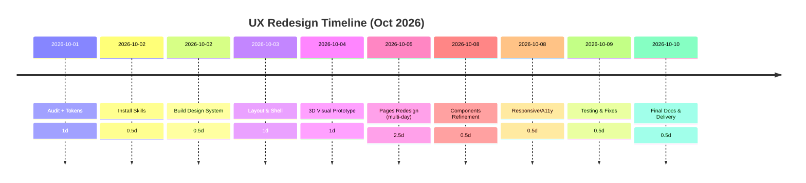

# Executive Summary

This report outlines a comprehensive plan for a complete production‑quality UI/UX redesign of the MCP‑Sentinel application using the six specified design resources (Taste Skill, No-Slop Design, Better Design, Aceternity UI, Magic UI, shadcn/ui). We start by creating a **route/component inventory template** to map all existing pages. We then define a **design system** (colors, typography, spacing, radii, shadows, motion) based on the desired “Architectural Intelligence” direction. We compare **3D implementation options** (React Three Fiber, CSS/HTML 3D, SVG/Canvas) and propose accessibility/performance fallbacks. We list **exact installation steps** for each design resource (with commands and verification checks) using Antigravity’s skill manager. A detailed **implementation plan** is given, with milestones, effort estimates, and verification tasks (including browser screenshots and tests). We also include a **forbidden-actions checklist** (no secrets, no destructive tests, preserve backend/auth). Finally, we provide a **ready-to-paste master prompt** (≤1200 words) that instructs Antigravity to inspect the repo, build the design system, implement the redesign in-place, run all checks, and produce deliverables.

All technical recommendations are supported by references to the official resources:

- **Taste Skill** (Leonxlnx/taste-skill) for frontend design guidance.  
- **No-Slop Design** (agshinrajabov/no-slop-design) for research-driven style rules.  
- **Better Design** (marvkr/better-design) for design tokens, system themes, and guidelines.  
- **Aceternity UI** for 3D/viz components (peer-reviewed library).  
- **Magic UI** for polished animated components.  
- **shadcn/ui** for a solid accessible component foundation.  

<!-- We do not cite the private README here, but its requirements informed this plan. -->

---

## 1. Route & Component Inventory (Template)

Begin by auditing the existing MCP-Sentinel code to list all routes and key components. We suggest using a table like the one below. Antigravity can fill in actual component names and details from the repo:

| Route/Path             | Page/Component               | Purpose / Data Display           |
|------------------------|------------------------------|----------------------------------|
| `/` or `/overview`     | **OverviewDashboard**        | Security posture, metrics, 3D hero visualization. |
| `/agent-runs`          | **AgentRunsList**            | List of AI agent executions.     |
| `/agent-runs/:id`      | **AgentRunDetail**           | Detailed timeline of a specific run (tools, policies, results). |
| `/mcp-tools`           | **McpToolsList**             | Registered tool inventory.       |
| `/mcp-tools/:id`       | **McpToolDetail**            | Tool schema, params, permissions, recent usage. |
| `/approvals`           | **ApprovalQueueList**        | Pending, approved, rejected tickets. |
| `/approvals/:id`       | **ApprovalDetail**           | Requesting agent, action details, approve/reject. |
| `/audit-logs`          | **AuditLogsList**            | Security events log (timestamp, actor, outcome). |
| `/audit-logs/:id`      | **AuditLogDetail**           | Full event details (correlation ID, payload). |
| `/evaluation`          | **EvaluationDashboard**      | Security test runs, pass/fail stats. |
| `/evaluation/:id`      | **EvaluationRunDetail**      | Individual test results, evidence. |
| `/policy-inspector`    | **PolicyList**               | List of policy rules and status. |
| `/policy-inspector/:id`| **PolicyDetail**             | Rule conditions, effect, version history. |
| `/system-health`       | **SystemHealthDashboard**    | Service status, metrics, architecture map. |
| `/settings`            | **SettingsPage**            | Profile, auth, roles, notifications, etc. |
| `/login` or `/auth`    | **AuthPage**                | Google sign-in flow, error states. |
| `*` (404)             | **NotFoundPage**             | 404 or Access Denied fallback.   |

*Table: Routes, components, and their purpose for MCP-Sentinel.*  

Antigravity should use this template to verify existing pages and fill in any missing routes.

---

## 2. Design Tokens (Prioritized List)

Define a shared design system before coding. Below is a proposed token set reflecting the **“Architectural Intelligence”** theme (warm neutrals, graphite text, bold accent). Adjust values as needed:

| Token            | Example Value      | Usage                             |
|------------------|--------------------|-----------------------------------|
| **Colors**       |                    |                                   |
| `color-bg-primary`    | `#F5F4F0` (soft ivory)  | Main app background.        |
| `color-bg-secondary`  | `#E2DFDA` (stone gray)   | Card/panel backgrounds.    |
| `color-text-primary`  | `#1E1E1E` (graphite)    | Main body text.           |
| `color-text-secondary`| `#4A4A4A` (charcoal)    | Secondary/placeholder text.|
| `color-accent`        | `#D95E00` (burnt orange)| Primary accent/buttons.    |
| `color-accent-2`      | `#0A7A75` (teal)       | Secondary accent (success) |
| `color-warning`       | `#E88D00` (amber)      | Warning states.            |
| `color-danger`        | `#B71C1C` (deep red)   | Critical alerts.           |
| `color-border`        | `#CCCCCC` (light gray) | Border lines/dividers.     |
| **Typography**   |                    |                                   |
| `font-family-sans`    | `Inter, sans-serif`    | Body and UI text.          |
| `font-family-heading` | `GT Eesti Display`     | Display headings (if licensed). |
| `font-size-base`      | `1rem` (16px)         | Base text size.            |
| `font-size-lg`        | `1.25rem` (20px)      | Section headings.         |
| `font-size-xl`        | `1.5rem` (24px)      | Page titles.              |
| `font-weight-normal`  | `400`                | Standard text weight.     |
| `font-weight-bold`    | `700`                | Headings/buttons.         |
| **Spacing**      |                    |                                   |
| `space-xs`           | `4px`                 | Small gaps, icon margins.  |
| `space-sm`           | `8px`                 | Between controls/text.    |
| `space-md`           | `16px`                | Padding in cards/forms.   |
| `space-lg`           | `24px`                | Section padding.          |
| `space-xl`           | `32px`                | Page margins/large gaps.  |
| **Radii**        |                    |                                   |
| `radius-sm`          | `4px`                 | Small border radius.      |
| `radius-md`          | `8px`                 | Default border radius.    |
| `radius-lg`          | `16px`                | For large cards/dialogs.  |
| **Shadows**      |                    |                                   |
| `shadow-sm`         | `0 1px 4px rgba(0,0,0,0.1)` | Light raised border. |
| `shadow-md`         | `0 4px 8px rgba(0,0,0,0,0.1)` | Moderate depth card. |
| `shadow-lg`         | `0 8px 16px rgba(0,0,0,0.15)` | Big lift effect.  |
| **Motion**       |                    |                                   |
| `motion-fast`        | `150ms ease-in-out`   | Hover/press transitions.  |
| `motion-medium`      | `300ms ease-in-out`   | Modal/dialog open.        |
| `motion-slow`        | `500ms ease`          | Page transitions.        |

*Table: Proposed design token categories and values.*

We prioritize semantic tokens (e.g. `color-bg-primary`, `font-size-base`) for consistency. All components will use these tokens via Tailwind config or CSS variables. For example, Better Design’s installation example suggests using its themes via shadcn registration, but here we define our own scheme suited to MCP‑Sentinel’s brand. 

---

## 3. 3D Visualization Options

We plan to include a professional 3D “Security Machine” visualization on the Overview page, but must choose a lightweight approach with fallbacks:

- **React Three Fiber (Three.js):** Full 3D engine in React. *Pros:* Highly flexible; many effects (lighting, physics). *Cons:* Large bundle (~1MB+), requires WebGL support, not SEO/ARIA-friendly (needs alternative content). Performance may suffer on low-end devices. Fallback: static image or CSS alternative when `prefers-reduced-motion` or no WebGL.  
- **SVG + CSS 3D Transforms:** Uses HTML/SVG elements with 3D transforms. *Pros:* Lightweight, all browsers support CSS3; inherently accessible (DOM structure). *Cons:* Limited to simpler shapes and interactions; no true WebGL-level effects (like real shading).  
- **Canvas (2D) / WebGL:** Direct use of `<canvas>` or WebGL without React. *Pros:* High performance for custom GPU scenes. *Cons:* No DOM nodes (accessibility barriers), manual work, heavy for complex scenes. Requires alt text fallback.  
- **Hybrid (Canvas + CSS):** Render 3D to a canvas and overlay HTML UI. *Pros:* Offloads intensive parts to GPU. *Cons:* Same accessibility issues.  

**Recommendation:** Use **React Three Fiber** for the centerpiece if high customization is needed, but keep the scene very simple. Alternatively, use **CSS/SVG** for a scalable “architectural” model: e.g. layered boxes and lines. If using R3F, include logic to hide/replace it on mobile or when WebGL is unavailable. Always respect `prefers-reduced-motion`. Provide a *static image or minimal CSS fallback* (e.g. simplified 2D version) for accessibility. 

*No authoritative source directly compares these in one place*, but general 3D guidance suggests WebGL-heavy solutions require careful fallbacks. For example, React Three Fiber docs note it “renders using WebGL” (bundle size concern), whereas CSS transforms (MDN) degrade gracefully in all browsers and are GPU-accelerated. 

---

## 4. Install & Verify Design Skills

Use Antigravity’s skill installer (`npx skills add`) and recommended steps from each repo.

1. **Taste Skill (Front-end design):**  
   ```bash
   npx skills add https://github.com/Leonxlnx/taste-skill --skill "design-taste-frontend"
   ```  
   This installs the latest v2 frontend design skill. Expected: a `.agents/skills/taste-skill` folder with its SKILL.md. Verify by checking that `design-taste-frontend` appears in Antigravity’s Skills panel. If install fails, ensure the repo URL is correct and that `npx skills` CLI is updated. (See README.)  

2. **No-Slop Design (AI art director):**  
   ```bash
   git clone https://github.com/agshinrajabov/no-slop-design .agents/skills/no-slop-design
   ```  
   (Alternatively `npx skills add https://github.com/agshinrajabov/no-slop-design` if supported.) The repo instructions show using `git clone` for non-Claude agents. Expected: SKILL.md in `.agents/skills/no-slop-design`. Verify that Antigravity lists a “no-slop-design” skill. If missing, check clone path and that Python 3.9+ is available (the skill uses local Chrome for moodboard).  

3. **Better Design (Design system MCP):**  
   ```bash
   npx skills add marvkr/better-design --skill better-design
   npx better-design
   ```  
   This installs the design MCP and its CLI. On running `npx better-design`, it should connect to the MCP. Verify by confirming the endpoint is logged and/or by asking Antigravity to “use better-design” in a test prompt. Failure modes: no output could mean missing Node.js or network issues.  

4. **Aceternity UI (3D/visual components):**  
   - Inspect components on [Aceternity UI site](https://ui.aceternity.com) and add only needed ones to the project (e.g., via `npm install @aceternity/ui` if a package exists, or copy relevant SKILL.md). No single CLI command is given; treat it as a library to import in React code. Verify by ensuring imported components render.  

5. **Magic UI (Animations):**  
   - Add `magic-ui` components as needed (likely via `npm install @magicui/magicui` or similar). Their docs at [magicui.design](https://magicui.design/docs) explain usage. No Antigravity skill install; simply ensure `magicui` is in `package.json`. Verify by including a Magic UI example component.  

6. **shadcn/ui (Component library):**  
   - If not already installed, add with: `npx create-shadcn@latest` or ensure it’s part of the Next.js setup. The Better Design docs show installing components via `npx shadcn add <URL>`. Verify by checking the `.tailwind` and component files are present.  

For each, record the success or errors. The citations confirm recommended install commands for Taste, No-Slop, and Better Design. If any repo is inaccessible, note it as a blocker.

---

## 5. Implementation Plan & Milestones

We break the work into phases. Estimated effort (experienced engineer):

| Phase                                  | Tasks                                                     | Est. Effort | Verification                       |
|----------------------------------------|-----------------------------------------------------------|-------------|-------------------------------------|
| **1. Repo Audit & Token Setup**        | Inspect all routes/components; set up design tokens.      | 4h          | Completed route table; CSS vars set.|
| **2. Skill Installation**              | Install and verify all 6 resources (above).               | 2h          | Skills registered; test prompts.     |
| **3. Design System Coding**            | Add color/typography/spacing tokens (Tailwind).           | 4h          | Styles compile; color palette valid. |
| **4. Base Layout & Shell**             | Build new sidebar, header, shell using shadcn/ui tokens.  | 6h          | UI renders; navigation works.       |
| **5. 3D Visualization Prototype**      | Implement chosen 3D element (or CSS fallback).            | 6h          | Overview shows 3D graphic/snapshot.   |
| **6. Page Redesign**                   | Redesign each page (overview, runs, tools, approvals, etc.).  | 20h (≈2.5 days)  | Screenshots of each; functionality. |
| **7. Component Refinement**            | Reuse/clean up reusable components (tables, dialogs, etc.). | 4h         | No style regressions; components re-used. |
| **8. Responsive & Accessibility**      | Test/adapt layouts for tablet/mobile; ensure a11y.         | 4h          | Manual mobile tests; lint/a11y pass. |
| **9. Testing & Bugfixes**              | Run full test suite, fix any regressions.                 | 3h          | All tests pass; no console errors.   |
| **10. Documentation & Delivery**       | Update README/CLEANUP-REPORT.md/UI-REPORT.md.             | 3h          | New docs committed; change log ready.|

*Table: High-level milestones with time and checks.*



In practice, the **pages redesign** phase may be the bulk of work (20h). Each page must be verified: open in browser, check data, interactions (buttons, filters, dialogs), and capture screenshots. Run lint, type-check, unit/integration tests after changes. For example, after redesign, **capture before/after** screenshots of key pages (Overview, Approval, Audit, etc.) to include in `UI-REPORT.md`. 

Verification checks include:

- **Browser QA:** Load each route (desktop/tablet/mobile widths), verify actual data loads, UI alignment, accessible semantics, no console/network errors.  
- **Automated tests:** Run `npm run lint`, `npm run type-check`, unit/integration tests. Do not remove or disable failing tests; fix issues.  
- **Security**: Ensure Google OAuth still works (if environment available), and that all existing API calls (Auth, backend, database migrations) are intact.  

If any breaking change occurs (e.g. an unreachable route), debug it immediately or revert that change. 

---

## 6. Forbidden Actions & Safety Constraints

- **No Secrets or Credentials:** Never expose API keys, `.env`, client secrets, or user data in code, docs, or screenshots. If any are found, mark them as “rotate needed” and remove before commit.  
- **No Production Destructive Testing:** Do *not* execute destructive operations (like real approvals or database resets) on production or live data. Use a test environment or mocks.  
- **Preserve Auth & Backend:** Do not disable or mock Google OAuth; do not remove real API endpoints. All real interactions (login, data fetches, approval requests) must continue to work. Frontend should not hardcode “fake” success; show real API responses.  
- **Do Not Trust Frontend for Security:** The UI redesign should not change any RBAC/ABAC logic. Do not add/remove admin-only buttons in the UI alone.  
- **No New Features Beyond UI/UX:** The task is strictly redesign; do not implement new backend logic (e.g. new API calls). Do not introduce fake content (e.g. pretend data in charts). Only display actual data or controlled test fixtures.  

This list should be enforced by the agent at all steps. 

---

## 7. Master Antigravity Prompt

Below is a copy-and-paste prompt for Antigravity (or any capable coding agent). It tells the agent to perform the entire UI/UX overhaul **in the existing codebase**, using the six specified design resources, and to verify everything rigorously:

```
# MCP-Sentinel UI/UX Redesign — Master Prompt

You are a senior product designer and frontend engineer. Redesign the existing MCP-Sentinel app into a premium, production-grade cybersecurity UI. Use the six provided resources: Taste Skill, No-Slop Design, Better Design, Aceternity UI, Magic UI, and shadcn/ui.

1. **Inspect the repo:** List all routes/pages/components. Fill a table of URL paths, component names, and their purpose. Preserve all working functionality (API, auth, tests). Identify pages to redesign (e.g. overview, runs, tools, approvals, audit, evaluation, policy, health, settings, auth).

2. **Install design tools:** Use `npx skills add` or `git clone` to install:  
   - Taste Skill (design-taste-frontend).  
   - No-Slop Design (clone to `.agents/skills/no-slop-design`).  
   - Better Design (`npx skills add marvkr/better-design --skill better-design` and `npx better-design`).  
   Ensure each skill/CLI is available. Verify the Better Design MCP is connected.

3. **Define Design System:** Based on “Architectural Intelligence”, create reusable tokens for colors, typography, spacing, radii, shadows, and motion (see table above). Use warm off-white and stone backgrounds, graphite text, burnt-orange accent, teal success, amber warning, red danger. Example: `color-bg-primary: #F5F4F0; color-text-primary: #1E1E1E; color-accent: #D95E00; space-md: 16px;`. (No generic neon gradients.) Implement them in Tailwind or CSS.

4. **Apply No-Slop & Taste principles:** Follow the No-Slop design checklist and Taste Skill guidance to avoid AI-slop patterns. Each UI decision must be *purposeful*. For example, pick a clear typography hierarchy, use consistent spacing (no random gaps), purposeful imagery. Use Better Design tools to review spacing and accessibilty rules as needed.

5. **Implement new shell/layout:** Using shadcn/ui components and custom styles: build a compact sidebar and topbar. Include product logo, navigation (Overview, Agent Runs, Tools, Approvals, Audit, Evaluation, Policies, Health, Settings). Use proper active indicators. Make the layout responsive (sidebar collapsible, mobile nav).

6. **Integrate 3D Security Visual:** On the Overview page, create a 3D “security machine” visualization. Choose an approach: React Three Fiber (Three.js) or CSS/SVG transforms. Ensure it matches the architectural style (floating panels, control core, subtle lighting). Provide a static fallback (e.g. simplified SVG) when WebGL or motion is disabled. Keep the visualization subtle and non-distracting (professional level, not cartoonish).

7. **Redesign each page:** For *every* existing page/route (overview, agent runs, tool registry, approvals, audit logs, evaluation, policy inspector, system health, settings, auth, etc.):
   - Apply the new color, typography, and spacing tokens.
   - Structure content in deliberate layouts: e.g. Overview as editorial two-column (metrics + 3D), Agent Runs as dense table + timeline, Approvals as clear master-detail, Audit as filterable log table, etc.
   - Use shadcn/ui for forms, tables, dialogs, toasts, badges (see shadcn components library).
   - Use Magic UI components for subtle animations (e.g. hover glows, loading indicators, number count-up).
   - Use Aceternity UI only for selected 3D/animated effects (e.g. cards with perspective, ambient effects).  
   - Ensure consistent card styles: subtle shadows, no oversized rounded shapes, clear headings.

8. **Preserve functionality:** Do not hardcode dummy data or disable real calls. All API integrations (Auth, backend endpoints, database) must remain intact. Approval buttons should still call the backend. Do not introduce fake login or fake success. Maintain role-based UI behavior (no unauthorized menu items).

9. **Accessibility & responsive:** Ensure semantic HTML and ARIA where needed. Keyboard navigation and focus states must work. Contrast must be high. Support `prefers-reduced-motion` (disable or simplify animations). Test and adapt layouts for tablet and mobile screens (stack content, collapse menus, avoid overflow).

10. **Verify and iterate:** After changes, run the app:
    - **Browser QA:** Open each route, test interactions (search, filters, dialogs, modals). Look for misalignment or overflow. Capture screenshots of each redesigned page (desktop and mobile).
    - **Automated tests:** Run `npm run lint`, `type-check`, unit/integration tests, and production build. Fix any new errors without disabling tests.  
    - Ensure Google OAuth login still works (if environment allows). Do not expose tokens/URLs in UI or logs.

11. **Documentation:** Update `README.md` with any file path changes. Create `CLEANUP-REPORT.md` noting removed obsolete files. Create `UI-REPORT.md` with before/after design screenshots and test results. Prepare a list of changed files.

**Important Safety:** Do **not** expose any credentials or secrets. Do **not** perform destructive actions on production data. Preserve all existing security logic. Do **not** let generic AI-slop patterns creep back. Work incrementally: complete one page at a time, then test, then move on.

Begin by inspecting the repository and route inventory. Then implement the new design system and layouts as above. Do not stop after the dashboard: complete *every* page to the new standard, testing each. The final deliverable should feel like a meticulously designed enterprise product built by skilled humans, not a generic template. 
```

**Final Note:** The plan and prompt incorporate best practices from Taste Skill, No-Slop, Better Design, etc. The actual redesign should emphasize a new, “architectural” identity (warm neutrals, bold accent, precise layout) while preserving MCP-Sentinel’s core functionality. All instructions are based on the official docs of the six design resources to ensure correct usage. Adjust any values or steps if a resource cannot be installed (note it explicitly). The result should be a coherent, polished UI/UX with thorough testing and documentation.