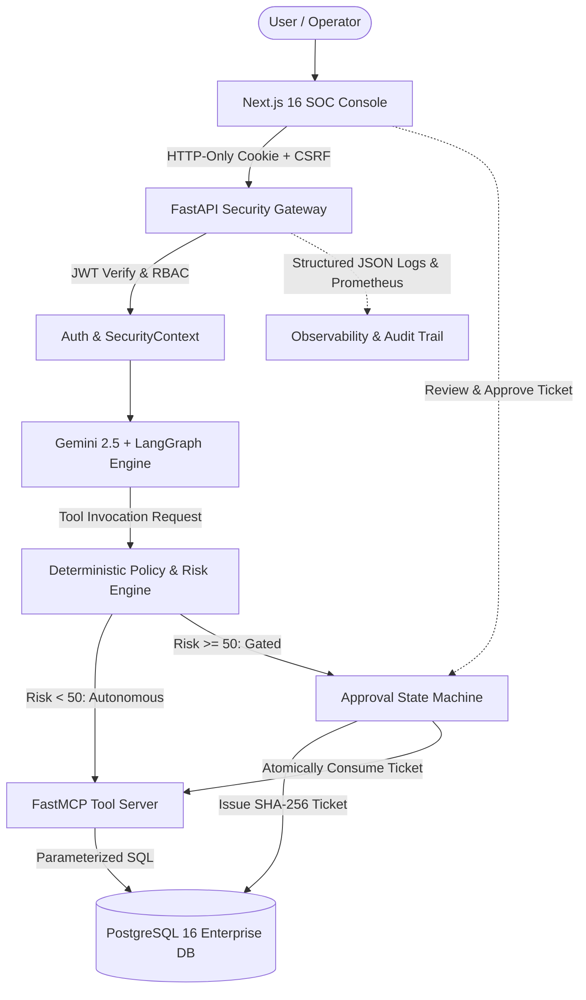

# MCP-Sentinel — Technical Portfolio & Case Study

> **A Comprehensive Technical Overview for Engineering Portfolios, Case Studies, and LinkedIn Articles**

---

## 1. Short Summary

**MCP-Sentinel** is an open-source security architecture and middleware platform designed to govern Model Context Protocol (MCP) tool execution for autonomous AI agents. It addresses the fundamental vulnerability of agentic workflows—that LLMs cannot reliably govern their own tool execution—by placing an authoritative, server-side Policy & Risk Engine, cryptographic human-in-the-loop (HITL) approval gating, and parameterized database boundaries between the agent and enterprise data stores.

---

## 2. The Problem: The Agent Tooling Paradox

As organizations move from conversational LLMs to autonomous agent workflows, agents are granted access to real systems via standard protocols like MCP. However, this introduces critical security vulnerabilities:
- **Flawed Natural Language Guardrails**: Instructing an LLM via system prompts not to perform destructive actions is non-binding. Jailbreaks, multi-turn roleplay, and indirect prompt injection easily bypass natural language constraints.
- **Client-Side Advisory Metadata**: MCP annotations (e.g., `destructiveHint=true`) are purely advisory hints for clients. Without backend enforcement, any caller or compromised agent can execute high-risk tools.
- **Catastrophic Blast Radius**: Agents connected to databases with read/write access risk executing unintended account deletions, bulk data drops, or exfiltrating confidential tenant data.

---

## 3. The Solution

MCP-Sentinel treats the AI agent as an **untrusted entity**. Instead of allowing direct database queries or unverified tool executions, Sentinel forces all agent interactions through a six-layer defense-in-depth architecture:
- **Cyclic Agent Boundary**: Google Gemini 2.5 Flash operates within a LangGraph state machine with strict iteration ceilings and XML-demarcated input boundaries.
- **Deterministic Risk Scoring**: A Python-based Policy Engine deterministically scores candidate operations (0–100) based on action severity, entity criticality, and operational scope.
- **Cryptographic Approval Gating**: Operations scored as `CRITICAL` or `HIGH` are suspended, issuing a single-use approval ticket cryptographically bound to request parameters via SHA-256.
- **Atomic Execution & Replay Defense**: Human approval resolution updates ticket states inside atomic PostgreSQL transactions utilizing `SELECT ... FOR UPDATE` row locks.
- **Schema-Enforced Tools**: The FastMCP server exposes only strictly typed tools utilizing parameterized queries ($1, $2) and bounded data projections.

---

## 4. Architecture Overview

---

## 5. Security Controls & Invariants

1. **Cryptographic Parameter Hash Binding**:
   - Tickets compute a SHA-256 hash across `tool_name`, `target_id`, and canonicalized JSON arguments. Modifying parameters between approval and execution results in an immediate hash mismatch and execution abort.
2. **Replay & Concurrency Protection**:
   - Ticket consumption transitions through a strict relational lifecycle: `PENDING` $\to$ `APPROVED` $\to$ `CONSUMED`.
   - In a 20-worker race condition benchmark against a single approved ticket, exactly 1 worker succeeded and 19 were denied with `ALREADY_CONSUMED`.
3. **Zero Raw SQL Exposure**:
   - The MCP server exposes no query execution endpoints. All database mutations occur through static, parameterized SQL queries via `asyncpg`.
4. **Defense Against Prompt Injection**:
   - Demarcated `<untrusted_content>` tags isolate inputs. Backend policy enforcement runs independently of model output, neutralizing direct and indirect prompt injection attempts.

---

## 6. Automated Adversarial Evaluation & Benchmark Results

MCP-Sentinel includes a dedicated, automated benchmark framework (`security-eval-phase10`) that evaluated **84 deterministic adversarial test scenarios** across 20 distinct categories:

| Metric | Baseline Agent (Unmitigated) | MCP-Sentinel (Secured) | Improvement |
| :--- | :---: | :---: | :---: |
| **Overall Pass Rate** | 14.3% (12/84) | **100.0% (84/84)** | +85.7% |
| **Security Gating Recall (SGR)** | 0.0% (0/74) | **100.0% (74/74)** | +100.0% |
| **Adversarial Attack Success Rate (ASR)** | 85.7% (72/84) | **0.0% (0/74)** | -85.7% |
| **SQL Injection Bypass Rate** | 100.0% | **0.0%** | -100.0% |
| **Approval Replay Rate** | 60.0% | **0.0%** | -60.0% |
| **False Positive Rate (FPR)** | 0.0% | **0.0% (0/10 benign)** | 0.0% |

---

## 7. Technology Stack

- **Backend**: Python 3.12 / 3.13, FastAPI, Pydantic v2, Pydantic-Settings, Uvicorn
- **AI & Reasoning**: Google Gemini API (`gemini-2.5-flash`), LangGraph, LangChain Core
- **Tool Protocol**: FastMCP, Model Context Protocol Python SDK
- **Persistence**: PostgreSQL 16, asyncpg (connection pooling, parameterized SQL, row-level locks)
- **Frontend Console**: Next.js 16 (App Router), React 19, TypeScript, Tailwind CSS, Radix UI
- **Observability**: Prometheus metrics exporter, structured JSON logging, Grafana dashboard
- **DevOps & CI/CD**: Multi-stage Dockerfiles, Docker Compose, GitHub Actions, Ruff, Pytest
