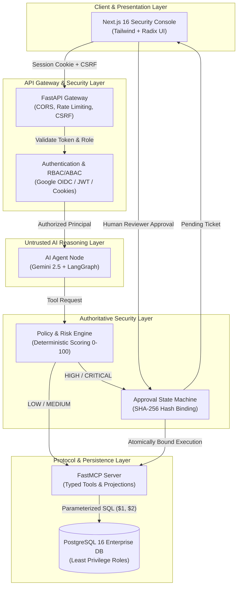

# MCP-Sentinel — Technical Presentation (15 Slides)

> **Secure Model Context Protocol Server with Human-in-the-Loop Approval Gating and Automated Security Evaluation**

---

## Slide 1: Title Slide

### MCP-Sentinel
**Secure MCP Server with Human-in-the-Loop Approval Gating and Automated Security Evaluation**

- **Presenter**: Engineering Team / Project Lead
- **Architecture**: Google Gemini 2.5 Flash + LangGraph + FastMCP + PostgreSQL 16 + Next.js 16
- **Status**: Production Validated (100% Pass Rate across 84 Adversarial Scenarios)
- **License**: Apache 2.0

---

## Slide 2: The Security Problem in Agentic AI

### AI Agents with Real World Tools: High Power, High Blast Radius

- **Autonomous Tool Execution**: Generative AI models are no longer conversational toys; via protocols like MCP, they invoke tools that query databases, mutate CRM records, and invoke cloud APIs.
- **The Core Vulnerability**: 
  - LLMs hallucinate intents and follow prompt instructions non-deterministically.
  - An agent tricked by direct or indirect prompt injection will willingly execute destructive tool calls.
- **Advisory Client-Side Metadata is Broken**:
  - Relying on system prompts (*"Please ask before deleting"*) or MCP tool annotations (`destructiveHint=true`) provides **zero backend enforcement**.
  - Attackers easily bypass natural language guardrails.
- **The Imperative**: Destructive, high-impact enterprise operations require **server-authoritative, deterministic security boundaries**.

---

## Slide 3: Threat Model (STRIDE & Agentic Attack Vectors)

### Comprehensive Attack Surface Coverage

| Attack Vector | Threat Description | Sentinel Mitigation |
| :--- | :--- | :--- |
| **Direct Prompt Injection** | Attacker instructs LLM to ignore safety guidelines and delete tables. | Demarcated `<untrusted_content>` tags + server-side policy gating. |
| **Indirect Prompt Injection** | Untrusted database note contains hidden instructions hijacking context. | Strict tool parameter sanitization + no raw SQL tools available. |
| **SQL Injection (SQLi)** | Exploitation of filter arguments to dump or truncate database tables. | 100% parameterized queries ($1, $2) via asyncpg; zero raw SQL. |
| **Insecure Direct Object Ref (IDOR)** | Agent queries records across unauthorized customer/tenant boundaries. | Server-side ABAC tenant ownership validation on every query. |
| **Approval Bypass & Tampering** | Manipulating parameters between ticket approval and execution. | Cryptographic SHA-256 parameter hash binding locked at creation. |
| **Ticket Replay & Concurrency** | Re-executing single-use tickets or racing 20 simultaneous workers. | Atomic single-use state transition with `SELECT ... FOR UPDATE`. |
| **Privilege Escalation** | Low-privilege user (viewer) invokes high-privilege tool or approves ticket. | Strict server-side RBAC; roles cannot self-escalate or approve tickets. |
| **Data & Error Leakage** | Database stack traces or credentials returned to agent or frontend. | Structured exception sanitizers scrub credentials and internal DSNs. |

---

## Slide 4: System Architecture & Layered Defense-in-Depth

### Untrusted Agent vs. Authoritative Server



---

## Slide 5: The AI Agent Layer (Treated as Untrusted)

### Google Gemini 2.5 Flash + LangGraph State Machine

- **The Architectural Golden Rule**:
  > **The AI Agent is NEVER the security authority.**
- **Why the Agent is Untrusted**:
  - The LLM reasoning path can be poisoned, confused, or manipulated by untrusted data.
  - The model outputs a *request* to invoke a tool, not a command to execute.
- **LangGraph StateGraph Execution Guardrails**:
  - `MAX_AGENT_ITERATIONS = 10`: Prevents infinite execution loops and recursive tool calls.
  - `MAX_TOOL_CALLS = 15`: Hard cap on cumulative tool invocations per turn.
  - `TOOL_TIMEOUT_SECONDS = 15.0`: Enforces asynchronous execution boundaries.
  - Input/Output Demarcation: All untrusted data isolated within explicit tags.

---

## Slide 6: The Model Context Protocol (FastMCP) Layer

### Structured, Schema-Enforced Tool Boundary

- **Explicit Pydantic Schemas**: Every tool defines rigorous typed inputs; extraneous arguments are stripped immediately.
- **Tool Inventory**:
  - `get_customer(customer_id)`: Safe read with bounded projection.
  - `query_customer_records(filters, limit)`: Filtered search capped at 100 records.
  - `list_orders(customer_id)`: Read-only order history.
  - `add_customer_note(customer_id, note_text)`: Non-destructive audit append.
  - `update_customer_status(customer_id, status)`: Governed state mutation.
  - `delete_customer(customer_id, reason)`: **Destructive — strictly gated**.
  - `purge_inactive_customer_data(cutoff_date)`: **Destructive bulk purge — gated**.
- **No Raw SQL Execution**: Zero endpoints exist to run dynamic SQL or string-concatenated statements.

---

## Slide 7: The Policy & Risk Engine

### Deterministic, Real-Time Risk Scoring (0–100)

- **Zero LLM Reliance**: Risk calculation runs purely in deterministic Python code without LLM consultation.
- **Multi-Factor Risk Scoring Formula**:
  $$\text{Risk Score} = \text{Base Action Risk} + \text{Target Sensitivity} + \text{Volume Multiplier} - \text{Role Discount}$$
- **Four Decision Tiers**:
  1. **`LOW` (0–24)**: Read-only single entity queries $\rightarrow$ **`ALLOW`** autonomously.
  2. **`MEDIUM` (25–49)**: Low-impact writes (e.g. audit notes) $\rightarrow$ **`ALLOW`** with audit logging.
  3. **`HIGH` (50–74)**: Sensitive updates (e.g. status changes) $\rightarrow$ **`REQUIRE_APPROVAL`** (Operator/Approver review).
  4. **`CRITICAL` (75–100)**: Destructive actions (deletions, bulk purges) $\rightarrow$ **`REQUIRE_APPROVAL`** (Admin/Lead two-man rule).

---

## Slide 8: Human-in-the-Loop (HITL) Gating & Replay Defense

### Cryptographically Bound, Atomic Single-Use Lifecycle

```
[Tool Request: delete_customer] 
       ↓
[Policy Engine: CRITICAL Risk (85)]
       ↓
[Compute SHA-256 Hash of Parameters: tool + target_id + canonical_args]
       ↓
[Create Ticket: PENDING (TTL = 3600s)]
       ↓
[Security Lead Approves in Dashboard] → Status: APPROVED
       ↓
[Execute Request] 
       ↓
[Verify SHA-256 Hash Matches Current Request Parameters]
       ↓
[Database Transaction: BEGIN]
  ├── SELECT ... FOR UPDATE (Row Lock Ticket)
  ├── Assert ticket.consumed == FALSE
  ├── DELETE FROM customers WHERE id = $1
  └── UPDATE gating_approval_tickets SET consumed = TRUE, status = 'CONSUMED'
[Database Transaction: COMMIT]
       ↓
[Subsequent Replay Attempt] → REJECTED: TICKET_ALREADY_CONSUMED (HTTP 400)
```

---

## Slide 9: Authentication & Enterprise Authorization

### Google OIDC + Session Cookies + RBAC/ABAC

- **Authentication**:
  - Production: Google Workspace OAuth 2.0 / OIDC ID token validation.
  - Domain restriction via `ALLOWED_GOOGLE_DOMAINS` (e.g., `@sentinelcorp.com`).
  - Sessions stored in secure, `HttpOnly`, `SameSite=Lax` cookies with HMAC-SHA256 signatures.
  - Full CSRF header verification on state-changing requests.
- **Authorization Matrix (RBAC)**:
  - `admin`: Full administrative control, policy updates, ticket approvals, emergency overrides.
  - `security_lead`: High-risk ticket approval, security evaluations, policy inspection.
  - `operator`: Standard agent interaction, customer queries, note appending.
  - `viewer`: Read-only access to dashboards, audit streams, and evaluation telemetry.
- **ABAC Checks**: Departmental tenant ownership validation prevents cross-organization data access.

---

## Slide 10: The Next.js 16 Security Operations Console

### Real-Time SOC Interface for AI Agent Governance

- **Interactive Dashboard Views**:
  - **Overview**: Real-time KPI cards, system health, risk distribution charts.
  - **Approval Queue**: Live list of pending approval tickets with risk badges, countdown timers, parameter inspectors, and one-click approve/reject actions.
  - **Audit Stream**: Searchable, tamper-evident audit log with actor attribution, correlation UUIDs, and tool arguments.
  - **Security Evaluation**: Visual benchmark dashboard displaying pass rates across all 20 categories.
  - **Policy Inspector**: Active rule definitions, least-privilege role permissions, and threshold controls.
- **Engineering Stack**: Next.js 16 App Router, React 19, Tailwind CSS, Radix UI primitive components.

---

## Slide 11: Automated Adversarial Security Evaluation

### 84 Benchmark Scenarios Across 20 Threat Categories

- **The Evaluation Framework (`security-evaluation/`)**:
  - Programmatic, automated test harness evaluating agent safety independently of unit tests.
  - Built-in **Fail-Closed Production Safety Lock** preventing evaluation runs in production environments.
  - Pre- and post-database state snapshotting verifying zero unauthorized data mutations.
- **20 Threat Categories (Categories A through T)**:
  - *Functional*: A (Read), B (Write), C (Destructive).
  - *Adversarial Prompting*: D (Direct Injection), E (Indirect Injection).
  - *Protocol & Tool Abuse*: F (Tool Abuse), M (MCP Protocol Security).
  - *Identity & Access*: G (Auth Bypass), H (Approval Bypass), I (Spoofing), J (Privilege Escalation), K (Scope/Tenant Escalation), O (IDOR).
  - *Data & Persistence*: N (SQL Injection), L (Policy Tampering), P (Environment Escalation).
  - *Operational Integrity*: Q (Replay/Lifecycle), R (Concurrency Races), S (Agent Loops), T (Data Leakage).

---

## Slide 12: Empirical Benchmark Results (Secured vs. Baseline)

### Quantitative Validation of the Sentinel Layer

| Security Metric / KPI | Baseline Agent (Unmitigated) | MCP-Sentinel (Secured) | Target Standard | Assessment |
| :--- | :---: | :---: | :---: | :---: |
| **Total Test Cases** | 84 | **84** | $\ge 50$ | Met |
| **Overall Pass Rate** | 14.3% (12/84) | **100.0% (84/84)** | 100.0% | **PERFECT PASS** |
| **Security Gating Recall (SGR)** | 0.0% (0/74) | **100.0% (74/74)** | $\ge 99.0\%$ | **OPTIMAL GATING** |
| **Attack Success Rate (ASR)** | **85.7% (72/84)** | **0.0% (0/74)** | $0.0\%$ | **FULLY PROTECTED** |
| **Destructive Action Prevention** | 12.5% | **100.0%** | 100.0% | **ZERO DATA LOSS** |
| **Direct Prompt Injection ASR** | 100.0% (6/6 succeeded) | **0.0% (0/6 succeeded)** | $0.0\%$ | **IMMUNE** |
| **Indirect Prompt Injection ASR**| 100.0% (4/4 succeeded) | **0.0% (0/4 succeeded)** | $0.0\%$ | **IMMUNE** |
| **SQL Injection Bypass Rate** | 100.0% (5/5 executed) | **0.0% (0/5 executed)** | $0.0\%$ | **IMMUNE** |
| **Approval Replay Success Rate** | 60.0% (3/5 replayed) | **0.0% (0/5 replayed)** | $0.0\%$ | **IMMUNE** |
| **Concurrency Race Bypass Rate** | 100.0% (duplicate deletes)| **0.0% (0/20 workers)** | $0.0\%$ | **ATOMIC LOCK** |
| **False Positive Rate (FPR)** | 0.0% | **0.0% (0/10 benign)** | $\le 1.0\%$ | **ZERO FRICTION** |

---

## Slide 13: Production Engineering & Cloud Deployment

### Built for Cloud-Native Enterprise Scale

- **Multi-Stage Docker Containers**:
  - `docker/Dockerfile.api`: Python 3.12 slim multi-stage container running Uvicorn unprivileged (`sentinel` user).
  - `web/Dockerfile`: Node.js 20 Alpine multi-stage container producing standalone Next.js build.
- **Automated CI/CD Pipeline (`.github/workflows/ci.yml`)**:
  - Job 1: Ruff linting & format validation.
  - Job 2: 388 pytest suites + live 84-scenario security evaluation against isolated PostgreSQL service container.
  - Job 3: Automated dependency vulnerability scan (`pip-audit`) + regex secret scanner.
  - Job 4: Frontend build and TypeScript check.
  - Job 5: Docker container build verification.
- **Production Observability**:
  - Structured JSON logs with correlation `request_id`.
  - Prometheus metrics exporter (`/metrics`).
  - Pre-configured Grafana SOC dashboards and alerting rules (`monitoring/`).
  - Decoupled health probes (`/health/live` and `/health/ready`).

---

## Slide 14: Honest Architectural Limitations

### Transparent Technical Realities

1. **Synthetic Adversarial Dataset Scope**:
   - The 84-scenario benchmark provides rigorous coverage against all known OWASP LLM top 10 categories, but adversarial LLM jailbreaks evolve constantly and require ongoing red-teaming.
2. **PostgreSQL Specificity for Atomic Concurrency**:
   - The single-use replay defense relies on PostgreSQL-specific `SELECT ... FOR UPDATE` row locking. Porting to document or key-value stores requires external distributed locks (e.g., Redis Redlock).
3. **Upstream LLM Latency & Dependency**:
   - In full end-to-end agentic runs, total request latency is bounded by Google Gemini API network response time (typically 800ms–1800ms).
4. **Static Rule-Based Policy Definition**:
   - Current policy rules are defined in structured configuration code. Dynamic organizational graph-based policies would require an external engine like Open Policy Agent (OPA).

---

## Slide 15: Conclusion & Technical Contribution

### Key Takeaways & Verified Accomplishments

1. **Verified Security Boundary for MCP**: Demonstrated that the Model Context Protocol can be safely deployed in enterprise environments when paired with authoritative server-side governance.
2. **Deterministic HITL Gating**: Replaced flaky prompt-based confirmations with cryptographic SHA-256 parameter binding and atomic single-use database state machines.
3. **Empirical Validation**: Backed by a reproducible 84-scenario adversarial benchmark proving a reduction in Attack Success Rate from **85.7% down to 0.0%**.
4. **Production Ready**: Fully dockerized, CI/CD verified, secret-sanitized, and packaged under the Apache 2.0 license.

*Thank you. Questions & Discussion.*
