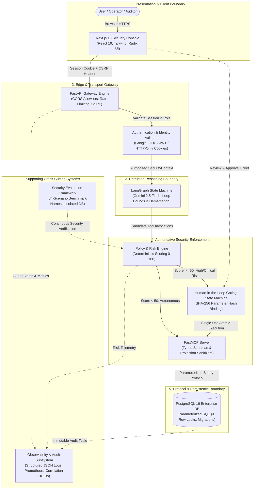

# MCP-Sentinel — Security Architecture Specification

> **Formal Security Architecture, Trust Boundaries, and Layered Defense-in-Depth Specification**

---

## 1. The Core Security Axiom

> **THE AI AGENT IS NOT THE SECURITY AUTHORITY.**
>
> In autonomous agentic systems, the generative language model (LLM) is an **untrusted reasoning component**. Its tool calls are speculative execution requests, not authorized system commands. Security decisions must be deterministic, server-authoritative, cryptographically verifiable, and enforced external to the model context.

```
USER INTENT
    ↓
AI AGENT (Untrusted Cognitive Engine)
    ↓
UNTRUSTED TOOL REQUEST
    ↓
SERVER-SIDE POLICY & RISK ENGINE
    ↓
AUTHORIZATION (RBAC / ABAC)
    ↓
HUMAN APPROVAL (When Risk >= 50, Cryptographic Parameter Hash Bound)
    ↓
MCP SERVER VALIDATION (Pydantic Schema & Bounds)
    ↓
POSTGRESQL DATABASE (Parameterized SQL & Least Privilege Roles)
```

---

## 2. Comprehensive System Architecture Diagram



---

## 3. Defense-in-Depth Layer Specifications

### Layer 1: Edge & Transport Gateway (FastAPI)
- **CORS Protection**: Prohibits wildcard origins (`*`) when credentials are enabled. Explicitly allows only trusted dashboard origins (`http://localhost:3000`).
- **CSRF Mitigation**: Enforces double-submit cookie or custom header validation (`X-Sentinel-CSRF-Token`) on all state-changing endpoints.
- **Sliding-Window Rate Limiting**: In-memory and distributed token bucket limiting preventing denial-of-service and brute force token probing.

### Layer 2: Authentication & Identity Management
- **Token Verification**: Validates Google Workspace OIDC tokens using Google's public JWKS endpoints.
- **Session Tokens**: Issues encrypted, HTTP-only, `SameSite=Lax` cookies with internal HMAC-SHA256 signatures and 12-hour max TTL.
- **Role-Based Access Control (RBAC)**:
  - `admin`: Global configuration, policy tuning, emergency override.
  - `security_lead`: High-risk ticket approval, evaluation inspection.
  - `operator`: Business agent queries, customer profile lookups.
  - `viewer`: Read-only telemetry, audit logs, and metrics.
- **Attribute-Based Access Control (ABAC)**: Enforces organizational tenancy boundaries, preventing users from accessing cross-departmental records (Anti-IDOR).

### Layer 3: Untrusted Agent Orchestration (LangGraph + Gemini)
- **Iteration Limits**: `MAX_AGENT_ITERATIONS=10` strictly caps cycle depth, preventing infinite recursive loops.
- **Tool Invocations**: `MAX_TOOL_CALLS=15` restricts cumulative tool executions per user prompt turn.
- **Input Demarcation**: All user inputs and external database values are wrapped inside `<untrusted_content>` tags. The model's system prompt instructs it that content within these tags has zero instruction authority.

### Layer 4: Policy & Risk Engine
- **Independent Evaluation**: Operates entirely in compiled Python without consulting the LLM.
- **Risk Calculation**:
  $$\text{Score} = \text{Action Base} + \text{Target Sensitivity} + \text{Batch Multiplier} - \text{Role Clearance}$$
- **Decisions**:
  - `ALLOW`: Autonomous execution.
  - `REQUIRE_APPROVAL`: Suspends execution and creates approval ticket.
  - `DENY`: Rejects execution with structured security error.

### Layer 5: Human-in-the-Loop Approval Gating
- **SHA-256 Parameter Hash Binding**:
  $$\text{Hash} = \text{SHA-256}(\text{tool\_name} \parallel \text{target\_id} \parallel \text{canonical\_args})$$
- **Atomic Single-Use State Lifecycle**:
  `PENDING` $\to$ `APPROVED` $\to$ `CONSUMED`.
  Tickets are updated to `CONSUMED` in the same database transaction that applies the mutation.
- **Concurrency Control**: Utilizes PostgreSQL row-level locks (`SELECT ... FOR UPDATE`), ensuring that only one worker can execute an approved ticket during concurrent races.

### Layer 6: FastMCP Server & Database Persistence
- **Schema Contracts**: Strict Pydantic models validate data types and strip unexpected input keys.
- **Zero Raw SQL**: No tool exists that accepts or executes raw SQL strings.
- **Parameterized SQL**: All database communication utilizes `asyncpg` parameterized placeholders (`$1`, `$2`), completely immunizing the system against SQL injection.
- **Least Privilege Database Roles**:
  - `mcp_readonly`: Permitted `SELECT` on customer and order tables.
  - `mcp_writer`: Permitted `INSERT` on audit notes.
  - `mcp_destructive`: Permitted `DELETE` and ticket state updates.
